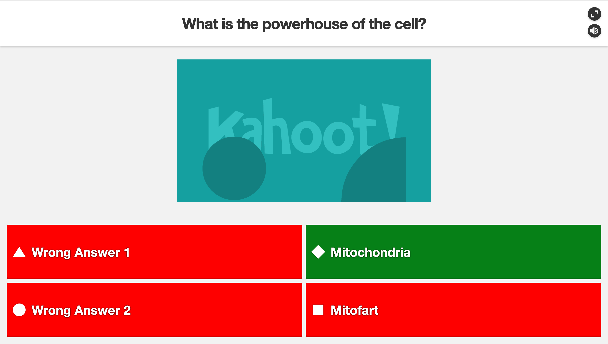

# Kahoot AI

**THIS EXTENSION WILL NOT ALWAYS BE 100% CORRECT!!!**

This is an extension that will get the question, google it, and then automatically figure out the answer.

This extension was made as a fun challenge and currently does work. There are alot of limitations and you may need to put in a custom serpapi api key but other than that its fine. I am going to work on making it a bit more user friendly and fix alot of bugs.

## Current Modes

#### Highlight correct question:

## Currently known bugs
- Math equations and other special text breaks the bot
- Can only work when the question is displayed on page (nothing I can do about that)
- Sucks at True/False questions (Will be very hard to fix)
- Will only pick one choice in multiple choice questions
- Incredibly slow when answer boxes don't exist
- Does not work for all types of answer boxes

Tested on google chrome and firefox
